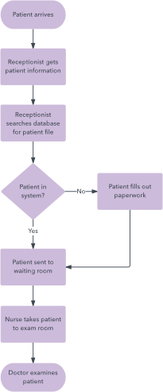
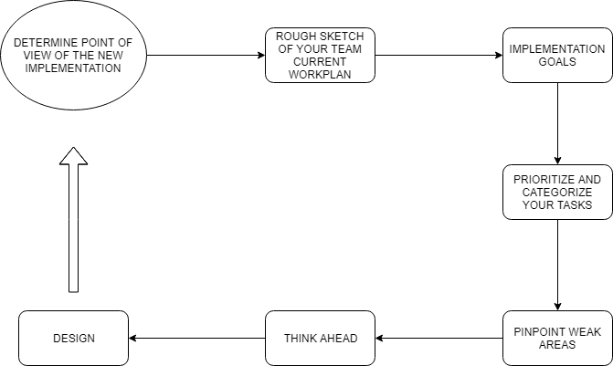

# **QA WORKFLOW**

I am [Alexandru Cercel](https://www.linkedin.com/in/alexandru-mihai-cercel-b49881180), student of the [Bachelor’s Degree in Video Games by UPC at CITM](https://www.citm.upc.edu/ing/estudis/graus-videojocs/). This content is generated for the second year’s subject Project 2, under supervision of lecturer [Ricard Pillosu](https://es.linkedin.com/in/ricardpillosu).

# What is QA Workflow

It is a step-by-step workflow on how to perform tasks that "ensure" the quality of the project from the beginning to the end of the task. During the development of the game the workflow changes with the different phases that there are, therefore the tasks and priorities change as we go forward and we are asked for different feedback based on the priorities of that development phase.

To reduce errors and minimize bugs, different tools are used to help us carry out our work. The organization is very important since we have to be constantly in contact with our team and provide quality feedback so that we can polish every feature as much as possible.

# What is the typical workflow of a major video game?

**Proposal phase -**  The team brainstorms and creates a high level design doc to pitch the concept in search of funding.

**Gate to preproduction** - The team creates a fuller and more technical project description, they solve some tech issues, get some concept art made, schedules projections and everything els that is needed

**Preproduction** - A very agile, exploratory phase of development. The goals are to solve all the outstanding questions, create asset pipelines, find the fun and produce a “vertical slice”  that is just a few minutes of finished  gameplay.

**Production** - Now that you know how to make content, the team gets really bulked up, the schedule gets firmer and lots of implementation starts. 

**Testing** - Traditionally, we made alpha versions (broken, incomplete, but winnable if only one way), beta versions (complete but buggy) and gold master candidates (we think this is the finished game - QA try to prove otherwise). Now, the versions are more incremental and can even continue to improve post launch. Still, the process is the same - clean, careful, numbered builds that go to QA for a full shakedown and hopefully a sign-off for public release. 

**Release support** - The newly released game is beeing watched and looking forward to make a patch to solve bugs and other problems that might be founded during the release.

Therfore the QA invervention during the project is like this: 

**Planning feedback**

Occasionally, a feature will seem simple, but the QA engineer knows in advance that it will actually be very difficult. To get this feedback in as early as possible, the QA engineer attends the iteration planning meeting. 

Based on this feedback, the team might choose to increase their estimates, change the scope, or move the feature further down the backlog.

**Pre-development testing notes**

As QA, we can often make accurate predictions about what bugs we’d find in a completed feature. If so, why not warn the developer in advance and save everyone the bother of dealing with the bug?

In order to achieve this, we introduced pre-development testing notes. They are a set of hints, written before development starts, about the type of bugs we might have expected to find in the story once it is complete. The goal is to enable the developer to avoid introducing the bugs in the first place.

Pre-development testing notes can vary significantly in size, depending on factors such as the scope and complexity of the story, the experience level of the developer, and the level of risk associated with the changes. 

**QA/developer demo**
Once a developer is happy that they have completed a feature, he or she will call over their QA engineer for a demo session. This has multiple purposes:

To allow the QA engineer to understand the implementation details of the story, down to the code level. This informs their decisions on risks, what testing needs to be added, and what testing is unnecessary.
To discuss what testing the developer has done and, what testing they still intend to carry out before they will push the changes to the repository.
The demo is a discussion between equals, and not a test that the developer or story can “pass” or “fail.” However, sometimes concerns are noticed during the demo, and these get quickly noted as comments on the story. This is much more lightweight than raising issues at this stage, they don’t need to be separately tracked, assigned, triaged, resolved, or tested  because they will be fixed within a few hours, while the developer is still working in his or her original context.

At the end of the demo, the QA engineer and developer will make a joint decision on what should happen to the story next. If both parties are confident about its quality, the feature is moved directly to Done.

**Post-development testing notes**
If either party feels that further testing is needed, the QA engineer will update the testing notes, removing any testing that’s already been done by the developer, and adding new risks based on the implementation of the feature. This eliminates duplication of effort and ensures efficient testing.

# Workflow diagrams 

A workflow diagram provides a graphic overview of how a specific role is done. Using standardized symbols and shapes, the workflow shows step by step how your work is completed from start to finish. It also shows who is responsible for work at what point in the process. Designing a workflow involves first conducting a thorough workflow analysis, which can expose potential weaknesses.

Workflows are also useful to help the team memabers understand their roles and the order in which work is completed, and to create more unity within different departments. Originating from the manufacturing industry, workflows are now used by a variety of industries—from government to finance to commerce—and are easier than ever to create.

Example of a workflow diagram: 

## How to make a workflow diagrm

# Traditional 

# Stabilization Phases

